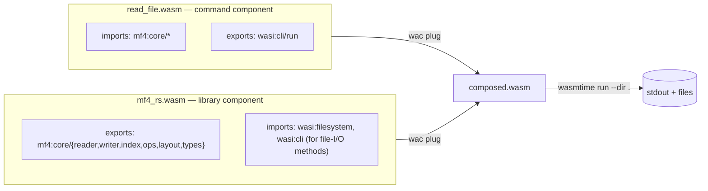

# Design: WASI Preview 2 component build for `mf4-rs`

Status: **approved, in implementation**
Target: `wasm32-wasip2` WebAssembly Component exporting the `mf4-rs` public API,
plus a set of example command components that consume it via component
composition.

This document is the agreed design. It reflects the following review decisions:

1. The component supports **both file I/O and pure bytes**.
2. Errors cross the WIT boundary as **strings** (`result<_, string>`).
3. Composition uses **`wac plug`**.
4. **Bytes-based `cut`/`merge`** helpers are added to the core crate (generally useful).
5. Examples live in **`wasi_examples/`**; WASI-P2-specific non-example files live in a
   **`wasi/`** folder (WIT, build scripts, README) with the Rust binding under `src/wasi/`.
6. **CI workflow updates** are part of this design (§8).

---

## 1. Background & constraints

- `mf4-rs` already ships a `wasm-bindgen` core-module binding ([`src/wasm.rs`](../src/wasm.rs))
  for `wasm32-unknown-unknown`, published to npm from `js/`. The WASI-P2 work is
  **purely additive** and does not touch that path.
- `wasm32-wasip2` still reports `target_arch = "wasm32"`. Everything gated
  `#[cfg(not(target_arch = "wasm32"))]` (native `MDF::from_file` + mmap, mmap
  readers, `cut`, `merge`) is compiled **out**. Therefore:
  - Parsing must go through `MDF::from_bytes` / `MdfIndex::from_bytes` (owned buffers).
  - File I/O on `wasm32-wasip2` uses `std::fs` (which *does* work on WASI P2) —
    **not** mmap.
- Component resources must be `'static` (own their data). `MDF`/`MdfIndex` from
  bytes are self-owned (already proven by `src/wasm.rs`), so they map cleanly to
  resources. `ChannelGroup`/`Channel` borrow the file and are exposed only through
  `mdf` methods, never as standalone resources.

## 2. Artifacts & layout

```
design/
  wasi-p2-component.md         # this file
wasi/
  wit/
    world.wit                  # the mf4:core@x.y.z package + `mf4` world
  README.md                    # toolchain + build/compose/run instructions
justfile                       # cross-platform build+compose+run driver (repo root)
wasi_examples/                 # separate cargo workspace (its own Cargo.toml)
  Cargo.toml                   # [workspace] over the example crates
  write_file/
  read_file/
  index_operations/
  cut_file/
  merge_files/
  visualize_layout/
src/
  fragments.rs                 # shared, target-neutral fragment reader (new)
  wasi/
    mod.rs                     # #[cfg(feature = "wasip2")] component impl
```

Two build outputs:

1. **Library component** — `cargo build --release --target wasm32-wasip2
   --features wasip2` → `target/wasm32-wasip2/release/mf4_rs.wasm` (a component
   exporting `mf4:core/mf4`; imports only the WASI interfaces its file-I/O methods
   need).
2. **Example command components** — each `wasi_examples/*` crate built for
   `wasm32-wasip2` is a `wasi:cli` command that *imports* `mf4:core/mf4`. Composed
   with the library via `wac plug`, then run with `wasmtime run --dir .`.



## 3. WIT (`wasi/wit/world.wit`)

`package` version tracks the crate version but is not release-critical (the
component is not published to a registry in this iteration).

```wit
package mf4:core@3.6.0;

interface types {
  enum data-type {
    unsigned-integer-le, unsigned-integer-be,
    signed-integer-le, signed-integer-be,
    float-le, float-be,
    string-latin1, string-utf8, string-utf16-le, string-utf16-be,
    byte-array, mime-sample, mime-stream,
    can-open-date, can-open-time, complex-le, complex-be,
    unknown,
  }

  variant decoded-value {
    unsigned-integer(u64),
    signed-integer(s64),
    float(f64),
    %string(string),
    byte-array(list<u8>),
    mime-sample(list<u8>),
    mime-stream(list<u8>),
    unknown,
  }

  record channel-info {
    name: option<string>,
    unit: option<string>,
    comment: option<string>,
    data-type: data-type,
    is-master: bool,
    bit-count: u32,
  }

  record group-info {
    name: option<string>,
    comment: option<string>,
    record-count: u64,
    channels: list<channel-info>,
  }

  record index-group-info {
    name: option<string>,
    record-count: u64,
    channel-names: list<string>,
    master-channel: option<string>,
  }

  record signal {
    name: string,
    unit: option<string>,
    timestamps: list<f64>,
    values: list<option<decoded-value>>,
  }

  record byte-range { offset: u64, length: u64 }
}

interface reader {
  use types.{group-info, signal};

  resource mdf {
    from-bytes: static func(data: list<u8>) -> result<mdf, string>;
    from-file: static func(path: string) -> result<mdf, string>;   // std::fs
    groups: func() -> result<list<group-info>, string>;
    channel-names: func() -> list<string>;
    values: func(name: string, group: option<string>) -> result<list<f64>, string>;
    read: func(name: string, group: option<string>) -> result<signal, string>;
    start-time-ns: func() -> option<u64>;
    file-layout-json: func() -> result<string, string>;
  }
}

interface writer {
  use types.{data-type, decoded-value};

  resource mdf-writer {
    constructor();
    init-mdf-file: func() -> result<_, string>;
    set-start-time: func(abs-time-ns: u64) -> result<_, string>;
    add-channel-group: func(name: option<string>) -> result<string, string>;
    add-channel: func(group-id: string, name: string, dt: data-type) -> result<string, string>;
    add-string-channel: func(group-id: string, name: string) -> result<string, string>;
    add-time-channel: func(group-id: string, name: string) -> result<string, string>;
    add-float-channel: func(group-id: string, name: string) -> result<string, string>;
    add-float32-channel: func(group-id: string, name: string) -> result<string, string>;
    add-int-channel: func(group-id: string, name: string) -> result<string, string>;
    add-sint-channel: func(group-id: string, name: string) -> result<string, string>;
    set-time-channel: func(channel-id: string) -> result<_, string>;
    start-data-block: func(group-id: string) -> result<_, string>;
    write-record: func(group-id: string, values: list<decoded-value>) -> result<_, string>;
    finish-data-block: func(group-id: string) -> result<_, string>;
    finalize: func() -> result<list<u8>, string>;             // pure bytes
    finalize-to-file: func(path: string) -> result<_, string>; // file I/O
  }
}

interface index {
  use types.{index-group-info, signal, byte-range};

  resource mdf-index {
    from-bytes: static func(data: list<u8>) -> result<mdf-index, string>;
    from-file: static func(path: string) -> result<mdf-index, string>;   // std::fs
    from-json: static func(json: string) -> result<mdf-index, string>;
    load-from-file: static func(path: string) -> result<mdf-index, string>;
    to-json: func() -> result<string, string>;
    save-to-file: func(path: string) -> result<_, string>;
    validate: func() -> result<_, string>;
    groups: func() -> result<list<index-group-info>, string>;
    channel-names: func() -> list<string>;
    file-size: func() -> u64;
    byte-ranges: func(name: string, group: option<string>) -> result<list<byte-range>, string>;
    byte-ranges-for-records: func(name: string, start-record: u64, record-count: u64,
      group: option<string>) -> result<list<byte-range>, string>;
    signal-byte-ranges: func(name: string, group: option<string>) -> result<list<byte-range>, string>;
    values-from-fragments: func(name: string, group: option<string>,
      ranges: list<byte-range>, fragments: list<list<u8>>) -> result<list<f64>, string>;
    read-from-fragments: func(name: string, group: option<string>,
      ranges: list<byte-range>, fragments: list<list<u8>>) -> result<signal, string>;
    // File-I/O convenience: reads the whole file via std::fs and decodes.
    values-from-file: func(name: string, group: option<string>, path: string)
      -> result<list<f64>, string>;
    read-from-file: func(name: string, group: option<string>, path: string)
      -> result<signal, string>;
  }
}

interface ops {
  // Pure bytes.
  cut-by-time: func(input: list<u8>, start: f64, end: f64) -> result<list<u8>, string>;
  cut-by-utc:  func(input: list<u8>, start-ns: u64, end-ns: u64) -> result<list<u8>, string>;
  merge:       func(first: list<u8>, second: list<u8>) -> result<list<u8>, string>;
  // File I/O (std::fs wrappers over the bytes cores).
  cut-by-time-file: func(input: string, output: string, start: f64, end: f64) -> result<_, string>;
  cut-by-utc-file:  func(input: string, output: string, start-ns: u64, end-ns: u64) -> result<_, string>;
  merge-file:       func(output: string, first: string, second: string) -> result<_, string>;
}

world mf4 {
  export types;
  export reader;
  export writer;
  export index;
  export ops;
}
```

Design notes:
- `data-type` drops the `Unknown(u8)` payload (maps to `unknown`), matching the
  string-collapsing behaviour of `src/wasm.rs`.
- Errors are `MdfError::to_string()`. A structured `variant mdf-error` can be
  introduced later without breaking the bytes/signal shapes.
- Lazy remote reads that need a host callback are intentionally *not* modelled;
  the fragment API plus `*-from-file` cover partial and whole-file reads.

## 4. Core crate changes

### 4.1 `Cargo.toml`
- New optional dependency: `wit-bindgen` (0.4x line, pinned at implementation time).
- New feature: `wasip2 = ["dep:wit-bindgen"]`.
- `crate-type = ["cdylib", "rlib"]` stays (cdylib drives the component build).

### 4.2 Shared fragment reader — `src/fragments.rs` (new)
Move the target-neutral fragment machinery (`FragmentStore`, `Coverage`,
`FragmentRangeReader`, and the `merge_ranges` helper) out of `src/wasm.rs` into a
new `src/fragments.rs` with no `wasm-bindgen`/`js-sys` dependency. `src/wasm.rs`
re-uses it (its JS marshalling stays put); `src/wasi/mod.rs` re-uses it for
`values-from-fragments` / `read-from-fragments`. This is a refactor with no
behaviour change; existing `js/` tests guard it.

### 4.3 Bytes-based `cut` / `merge`
- `src/cut.rs`: extract the transform body into a private
  `cut_core(src: &MdfFile, out: &mut MdfWriter, start, end)`. Keep the existing
  `cut_mdf_by_time` / `cut_mdf_by_utc` (path + mmap, native only) as thin wrappers,
  and add public, target-neutral:
  - `cut_mdf_by_time_bytes(data: &[u8], start: f64, end: f64) -> Result<Vec<u8>, MdfError>`
  - `cut_mdf_by_utc_bytes(data: &[u8], start_ns: u64, end_ns: u64) -> Result<Vec<u8>, MdfError>`
  built on `MdfFile::parse_from_bytes` + `MdfWriter::new_from_writer(Cursor)`.
- `src/merge.rs`: same split → public `merge_files_bytes(first: &[u8], second: &[u8]) -> Result<Vec<u8>, MdfError>`.
- `src/lib.rs`: relax module gating so the **bytes cores compile on all targets**;
  only the path wrappers remain `#[cfg(not(target_arch = "wasm32"))]`.
- Native unit tests added for the `_bytes` variants (round-trip parity with the
  path-based fns).

### 4.4 Component implementation — `src/wasi/mod.rs` (new, `#[cfg(feature = "wasip2")]`)
- `wit_bindgen::generate!({ world: "mf4", path: "wasi/wit" });`
- `struct Component;` implementing every generated `Guest*` trait.
- Resources:
  - `MdfRes(Box<MDF>)` — `from-bytes`, `from-file` (`std::fs::read` → `from_bytes`),
    metadata, `values`, `read`, `start-time-ns`, `file-layout-json`.
  - `MdfWriterRes { writer: Option<MdfWriter>, sink: Rc<RefCell<Cursor<Vec<u8>>>>,
    id maps… }` — ported verbatim from `src/wasm.rs` (the `SharedBuf` cursor +
    Python-style ID mapping), plus `finalize-to-file`.
  - `MdfIndexRes(MdfIndex)` — `from-bytes`/`from-file`/`from-json`/`load-from-file`,
    `to-json`/`save-to-file`, metadata, byte-ranges, fragment reads (via
    `src/fragments.rs`), and `*-from-file` (whole-file `std::fs::read` +
    `SliceRangeReader`).
  - `ops` free functions delegate to §4.3 (`_bytes`) or `std::fs` + `_bytes` for
    the `-file` variants.
- Value/type mapping helpers (`decoded-value ↔ DecodedValue`,
  `data-type ↔ DataType`, `Signal → signal`) — WIT-native, no `js-sys`.
- Registered in `src/lib.rs`: `#[cfg(feature = "wasip2")] pub mod wasi;`.

## 5. Example ports (`wasi_examples/`)

Separate cargo workspace (kept out of the root workspace to avoid
feature/target contention). One binary crate per native example; each is a plain
`fn main()` for `wasm32-wasip2` (rustc emits the `wasi:cli/run` export
automatically) that generates **import** bindings with
`wit_bindgen::generate!({ world: "mf4", path: "../wasi/wit" })` and prints with
`println!`.

| native example | crate | leverages |
|---|---|---|
| [`examples/write_file.rs`](../examples/write_file.rs) | `write_file` | `writer` → `finalize-to-file` (file I/O) + `finalize` (bytes) |
| [`examples/read_file.rs`](../examples/read_file.rs) | `read_file` | `reader.from-file`, groups/channels/values/read |
| [`examples/index_operations.rs`](../examples/index_operations.rs) | `index_operations` | `index.from-file`, `to-json`/`save-to-file`, `byte-ranges`, `values-from-file` |
| [`examples/cut_file.rs`](../examples/cut_file.rs) | `cut_file` | `writer` + `ops.cut-by-time-file` + `reader` |
| [`examples/merge_files.rs`](../examples/merge_files.rs) | `merge_files` | `writer` + `ops.merge-file` + `reader` |
| [`examples/visualize_layout.rs`](../examples/visualize_layout.rs) | `visualize_layout` | `reader.file-layout-json` |

Because the *library* component performs the file I/O for the `-file` / `from-file`
methods, the example components stay tiny and mostly need only stdout — but the
composed program is still run with `wasmtime run --dir .` so the library's
filesystem imports are satisfied.

## 6. Build / compose / run pipeline

Toolchain (documented in `wasi/README.md`):
- `rustup target add wasm32-wasip2`
- `cargo install wac-cli wasm-tools`
- a `wasmtime` binary (>= 24, component model on by default)

Driver (`justfile` at the repo root, recipe `just run`) does:
1. `cargo build --release --target wasm32-wasip2 --features wasip2`
2. For each example: `cargo build --release --target wasm32-wasip2` (via `--manifest-path wasi_examples/Cargo.toml`)
3. `wac plug <example>.wasm --plug target/.../mf4_rs.wasm -o target/.../<example>.composed.wasm`
4. `wasmtime run --dir . target/.../<example>.composed.wasm`

(`just wit` runs `wasm-tools component wit` as a sanity check; `just compose`
stops before the wasmtime run.)

## 7. Testing

- Native `cargo test`: new round-trip tests for `cut_*_bytes` / `merge_files_bytes`
  (parity with the path-based fns).
- `cargo check --features wasip2 --target wasm32-wasip2` compiles the component
  (guarded in CI).
- Smoke: build + compose + run each example under `wasmtime` in CI; assert exit 0
  and expected stdout markers.
- The existing `js/` test-suite continues to guard the fragment reader refactor.

## 8. Workflow / CI updates

### 8.1 New workflow `.github/workflows/wasi.yml` (PR + manual)
Triggered on PRs touching `src/**`, `wasi/**`, `wasi_examples/**`, `Cargo.toml`,
or the workflow file. Steps:
- `dtolnay/rust-toolchain@stable` with `targets: wasm32-wasip2`.
- Install `wasm-tools`, `wac-cli` (via `cargo binstall` or `cargo install`),
  and `wasmtime` (bytecodealliance/actions/wasmtime or download).
- Cache cargo + target dirs.
- Build the library component (`--features wasip2 --target wasm32-wasip2`).
- `wasm-tools component wit` to assert the exported world matches `wasi/wit`.
- Build every `wasi_examples/*` crate, `wac plug` each, and `wasmtime run --dir .`,
  asserting success. This is the primary regression gate for the component.

### 8.2 `build-wheels.yml`
No functional change required, but its `paths:` filter already covers `src/**`;
the WASI job lives in its own workflow so wheel builds are unaffected.

### 8.3 `release.yml`
- Add a non-publishing **`build-wasi-component`** job (mirrors `publish-npm`'s
  structure but without upload) gated on `bump-and-tag`, so a release build also
  proves the component still builds for the tagged commit. Publishing the
  component to a registry (warg) is **out of scope** for this iteration and is
  noted as future work.
- No changes to the version-bump logic. WASI-only changes use the existing
  Conventional-Commit types (`feat:` for new component/API surface, `build:`/`ci:`
  for tooling), so the release pipeline treats them exactly like any other change.
- `wasi/`, `wasi_examples/`, and `design/` are documentation/tooling; they are not
  packaged into the crate, the wheel, or the npm tarball.

## 9. Out of scope (future work)

- Publishing the component to a component registry (warg / OCI).
- Lazy remote (HTTP/host-callback) reads over the component boundary.
- `##DZ` decompression (unchanged from the native library).
- A structured `variant mdf-error` (strings for now).
